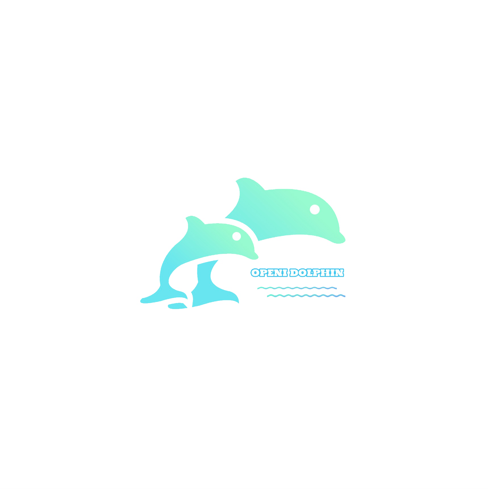

# OpenI Dolphin

[](https://img.shields.io/github/last-commit/lin-yuxiang/dolphin)
[](https://open-dolphin.readthedocs.io/en/latest/?badge=latest)
[](https://img.shields.io/badge/python-3.6%20%7C%203.7-orange)
[](https://img.shields.io/github/repo-size/lin-yuxiang/dolphin)
</br>

<div  align="center">

</div></br>


Documentation: https://open-dolphin.readthedocs.io

--------

## Introduction

**Dolphin** is an open-source computer vision algorithm framework in fields of *Object Detection*, *Semantic Segmentation*, *Video Action Analysis*, *Mono Depth Estimation*, *Generative Adversarial Networks* and *Activate Learning*.

## Installation

The code was tested under environment of python 3.7, ubuntu 16.04 and CUDA 10.0+. It's recommended to create virtual environment using Conda:
```shell
conda create --name dolphin python=3.7
```  
Then clone this repo and install the prerequisites by 
```shell
pip install -r $(DOLPHIN_ROOT)/requirement.txt
pip install git+https://github.com/philferriere/cocoapi.git#subdirectory=PythonAPI
```

## Data Preparation

Firstly create a corresponding directory in the root dir of project, for example ``mkdir $(DOLPHIN_ROOT)/data/depth`` , then run the data creating script at ``$(DOLPHIN_ROOT)/scripts/depth/create.sh`` , to download dataset and pretrained models if needed. These paths should be assigned in the configuration file for training or testing. 
NOTE: For task of activate learning, we use MNIST dataset which can be downloaded by torchvision automatically, so it's not necessary to run the create script for dataest, but in the configuration file the path of *data_prefix* should be set up to indicate the data location.

## Quick Start

### Import Modules:

In the file of ``$(DOLPHIN_ROOT)/dolphin/utils/registry.py`` , the modules (or sub modules) needed to import should be added to every module file lists, for instance: For the task of Depth Estimation, model modules include backbone, head and decoder, so their filename has been added to the list of ``MODEL_MODULES`` . And its algorithm module (the module that takes in charge of combination of every model module) and engine module (specific engine module which includes testing method) have also added into the list of ``ALGORITHM_MODULE`` and ``ENGINE_MODULE`` correspondingly. This step ensures all the components are callable for the algorithm.
NOTE: Configuration of importing modules can refer to file *yaml* (configuration file, located in dir ``$(DOLPHIN_ROOT)/dolphin/configs``).

### Configuration File:

It is also necessary to add parameters of every module into the configuration file (located in ``$(DOLPHIN_ROOT)/dolphin/configs/``) , the FCRN algorithm for mono depth estimation is an example for it. The hierarchy of configuraiton file consists of several four parts: engine, algorithm, data, runtime. As the name suggests, the part of engine, algorithm and data are used for specifying corresponding modules. The rest part, runtime, serves as the role to controll workflow phase: learning rate, total epochs and work dir path can be put up here. Additionally, the file *logger.yaml* on configuration directory is used to set up the logger name, logger file path and so on.

### Start Running:

After finishing above steps, it's quickly to run ``python $(DOLPHIN_ROOT)/dolphin/main.py --config $(CONFIGURATION FILE PATH)`` on the terminal to start the task.